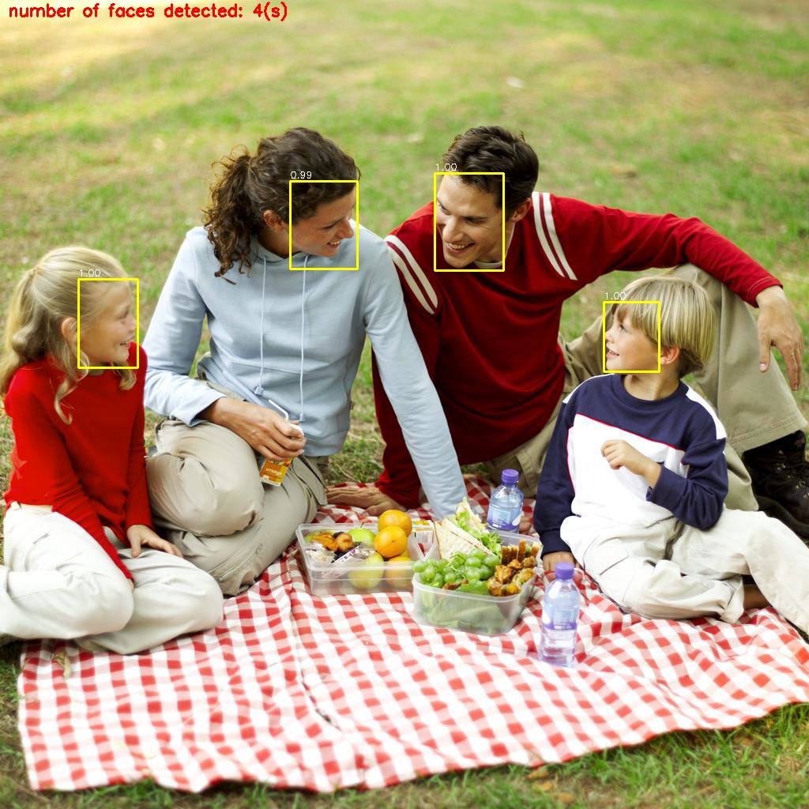
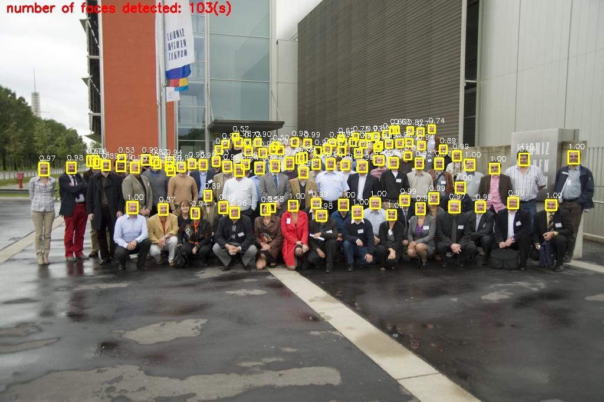

# YOLOFace

# Deep learning based Face detection using the YOLOv3 algorithm


## Getting started

The YOLOv3 (You Only Look Once) is a state-of-the-art, real-time object detection algorithm. The published model recognizes 80 different objects in images and videos. For more details, you can refer to this [paper](https://pjreddie.com/media/files/papers/YOLOv3.pdf).

## YOLOv3's architecture


Credit: [Ayoosh Kathuria](https://towardsdatascience.com/yolo-v3-object-detection-53fb7d3bfe6b)

## OpenCV Deep Neural Networks (dnn module)

OpenCV `dnn` module supports running inference on pre-trained deep learning models from popular frameworks such as TensorFlow, Torch, Darknet and Caffe.

## Prerequisites

* tensorflow
* opencv-python
* opencv-contrib-python
* numpy

Install the required packages by running the following command:

```bash
$ pip install -r requirements.txt
```

**Note:** This repositoty works on Python 3.x. Using Python virtual environment is highly recommended.

## Usage

* Clone this repository
```bash
$ git clone https://github.com/sthanhng/yoloface
```

* For face detection, you should download the pre-trained YOLOv3 weights file which trained on the [WIDER FACE: A Face Detection Benchmark](http://mmlab.ie.cuhk.edu.hk/projects/WIDERFace/index.html) dataset from this [link](https://drive.google.com/file/d/1xYasjU52whXMLT5MtF7RCPQkV66993oR/view?usp=sharing) and place it in the `model-weights/` directory.

* Run the following command:

>**image input**
```bash
$ python yoloface.py --images samples/outside_000001.jpg --output-dir outputs/
```

>**video input**
```bash
$ python yoloface.py --video samples/subway.mp4 --output-dir outputs/
```

>**webcam**
```bash
$ python yoloface.py --src 1 --output-dir outputs/
```

## Sample outputs





## License

This project is licensed under the MIT License - see the [LICENSE.md](LICENSE.md) file for more details.

## References

